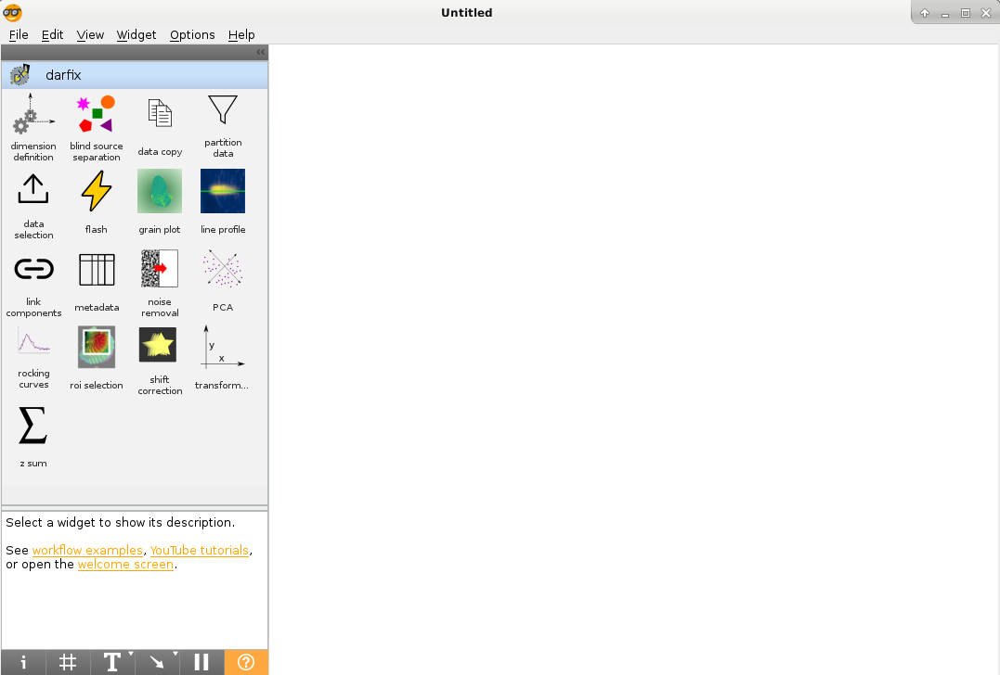
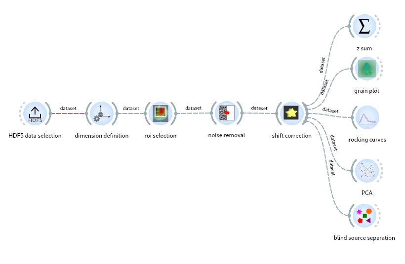
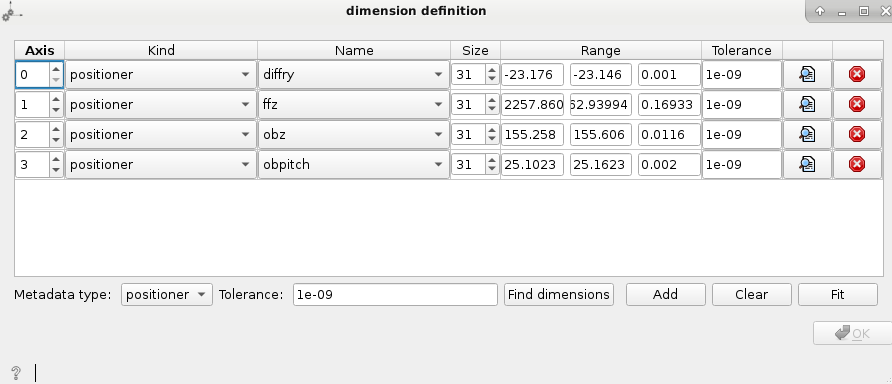
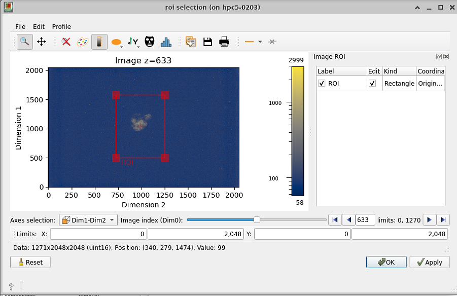
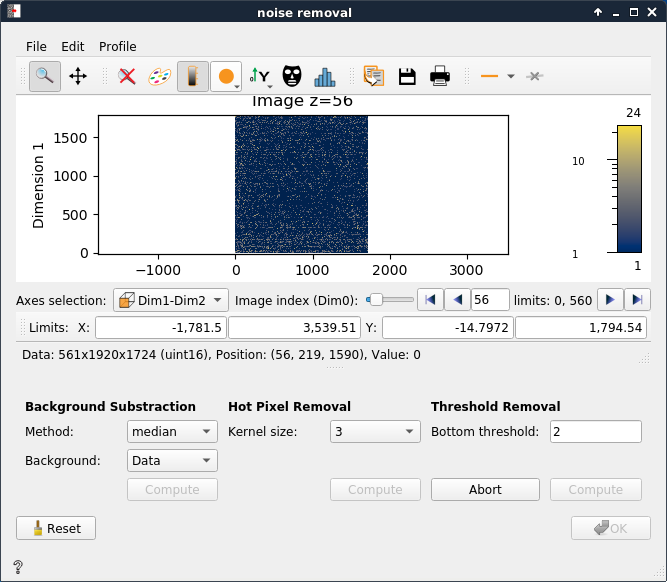
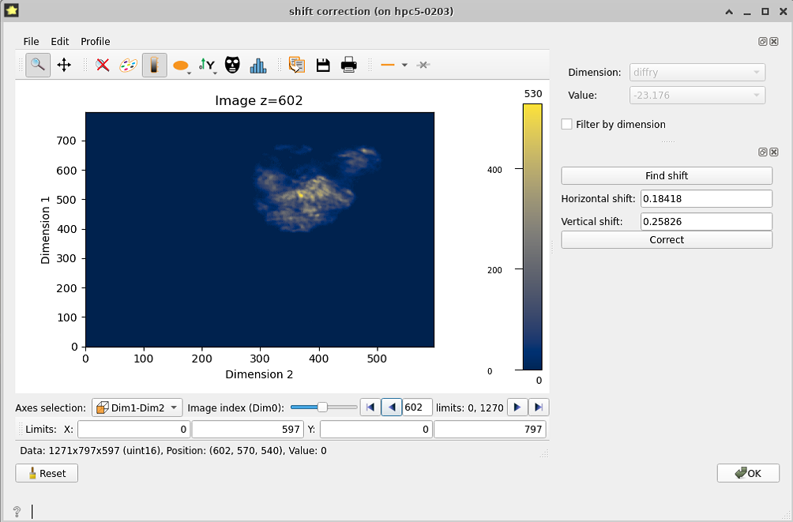
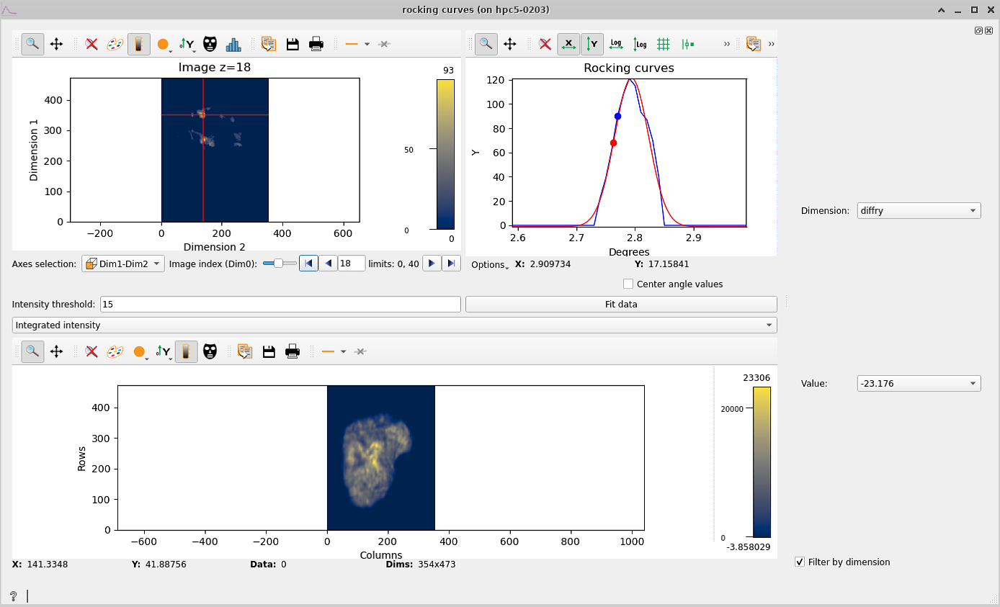
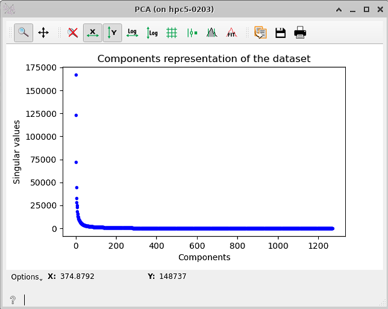
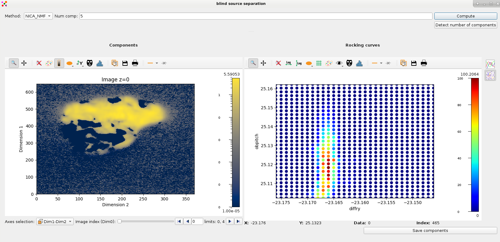

Introduction to Darfix (2.x)
============================

darfix is a Python library for the analysis of dark-field microscopy data. It
provides a series of computer vision techniques, together with a graphical user
interface and an Orange3 (https://github.com/biolab/orange3) add-on. darfix
is to be used as a workflow, where every step of the analysis can be applied
independently.
The aim of this tutorial is to guide you into correctly executing darfix into a correct
analysis of your images.

The main functionalities of darfix can be divided in 3 parts:

#. Load the data and select the different motors (dimensions). Select a transformation technique (RSM, magnification), if needed.
#. Pre-analysis of the images by applying several operations like region of interest, noise removal and shift correction.
#. Apply DFXM analysis to the images. The DFXM techniques currently in darfix are:

* Rocking curve imaging: The data is fitted along the z-dimension (pixel by pixel), to follow a certain distribution (gaussian). After that 3 maps are shown: intensity, FWHM, and … The fitted data is saved on disk in HDF5 format.
* Grain plot: Several maps are plotted which can be exported into a single file: COM, FWHM, skewness, kurtosis (for every dimension), and mosaicity and orientation distribution maps in case of 2D datasets.
* Blind source separation: An experimental technique that uses different blind source separation techniques to find grains along the dataset, tests with different datasets have shown good results with techniques like NMF, NNICA, and NMF+NNICA.

*darfix* can be either executed using plain code (using for example a jupyter notebook), or
by using the Orange3 software that allows the creation of workflows in a GUI
environment. This last is recommended in most cases as it allows for an easier and
graphical view of the different steps.
Once a workflow is created via Orange it can be saved and transformed to a single script
using ewoks, which can then be executed with different dataset inputs.
For now, to use darfix the dataset has to be of a certain format as the obtained scans
from BM03:

1. The data format should either **HDF5** or **EDF**
2. Motor information should be contained in metadata.
    * For HDF5: a group should contain all positioners datasets.
    * for EDF: headers should contain motors_mne information.
3. The data should be images.

This tutorial will basically introduce the graphical interface using Orange, for a tutorial
using the core functions of darfix you can go to `darfix_tutorial.ipynb <https://gitlab.esrf.fr/XRD/darfix/-/blob/master/docs/source/tutorials/darfix_tutorial.ipynb>`_

How to access it
----------------

If you have access to the slurm cluster (or any official esrf computer) you can use 'linux' modules to access the software.
Else you will need to install it before using it.

With access to the ESRF cluster
"""""""""""""""""""""""""""""""

1. connect to the cluster

.. code-block:: bash

    ssh -XC cluster-access

2. allocate node with appropriate resources

.. code-block:: bash

    salloc -p interactive –x11 srun –pty bash

3. load the darfix module

.. code-block:: bash

    module load darfix

.. hint::

    you can specify a version to be used when loading darfix(`module load darfix{version}`).
    For example to load the 'dev' version:
    
    .. code-block:: bash
        
        module load darfix/dev
    
    You can also use `ml` as an alias of `module load`

    .. code-block:: bash
        
        ml darfix

4. Launch darfix

.. code-block:: bash

    darfix-canvas

then the following window should appear:

without access to the ESRF cluster
""""""""""""""""""""""""""""""""""

see :ref:`Installation`

Workflow creation
-----------------

To create the workflow just click on any widget you want from the left (usually start with **data selection**). From every widget you can create links to other widgets:

Data selection
""""""""""""""

Data selection can be done either from HDF5 or EDF datasets (legacy).

For a HDF5 dataset
******************

TODO:

For more details see :ref:`HDF5 data selection`

For a EDF dataset
*****************

See :ref:`EDF data selection`

Dimension definition
""""""""""""""""""""

This step allows you to input the necessary motor information of the dataset, which will
be used at future steps. Normally, you’ll want to set the dimensions to be the moving
motors, for this the metadata type has to be set to **positioner**. The **Find dimensions**
option will look for moving motors and show you the ones that change through the
dataset (difference higher than the **tolerance** value). Once the dimensions are found,
you can check which motors you want to work with and make sure the range values are
ok. In case the **minimum** and **maximum** values are ok, but the **step** is wrong, you can set
the step value to 0 and add the correct **size**.

After that you can try to **Fit** the dimensions. If the fit was correctly done it means that
the product of the size of your motors corresponds to the number of images on your
dataset. If the fit can’t be done look again at the range and size values.

Transformation
""""""""""""""

The Transformation widget allows you to modify the axes of the plots so that they
include the size in microns of the camera instead of the size in pixels. With one
dimension datasets you can choose between a RSM transformation or a magnification.
With two or more dimensions you can only apply magnification.

Partition
"""""""""

In cases with a large number of images you may want to omit the images with low
intensity. This widget allows you to see an intensity curve of the images and to choose
how many images you want to keep. At the next steps of the workflow only the images
with higher intensity will be used for the analysis.

Region of interest
""""""""""""""""""

If your sample appears only in a part of the image all along the dataset it’s good to apply
a region of interest, both to make the analysis faster (less data), and to help you see
closer the different features of the sample.

To select the ROI in the widget, you can move and reshape the red rectangle that
appears on the view, and click **Apply** to see how the region will be applied. If the ROI is
good for you, you can click OK to go to the next step.
*Apply has to be clicked before Ok for the ROI to be applied.*

Noise removal
"""""""""""""

This step allows you to subtract background and remove hot pixels and data below a
certain threshold (user defined).
If possible (specially when the data is not in memory) an **Abort** button will appear after
clicking **Compute** (for each method), this allows to cancel the operation if needed.

Once you have completed noise removal you can press **OK** and follow to the next step of
the procedure.

.. tip::

    Consider the data! If the data/Background Intensity
    relation is big, you can considerably increase your threshold, if the difference between data
    and background is not so big, you might be losing information by removing too much.

Shift detection and correction
""""""""""""""""""""""""""""""

Depending on the acquisition conditions of the raw data, the consecutive images might
show a displacement of the object of study that does not correspond to reality. This
displacement is here identified as shift and can be calculated by the program. This can be
done either simultaneously along all the dataset, or individually for each motor.

This last case is activated when clicking the Filter by dimension option. With this option active,
the **Find shift** button loops through the values of the selected dimensions and finds, for
each value, the linear shift of its corresponding images (the images that have that motor
value, which are the ones you see on the plot). It not only finds the shift for the selected
value but for **all** values of that dimension.

After the shift is found, you can move through
the values and see the different found shifts. After that clicking **Apply shift** will apply all
the shifts found to the corresponding images (although clicking Apply only to selected
values, which only applies the shift to the images you see on the plot).

This step allows you to subtract background and remove hot pixels and data below a
certain threshold (user defined).

Rocking curve imaging
"""""""""""""""""""""

The rocking curves widget allows you to see a curve of the intensity of each pixel along
the dataset. The plot on the top left shows you the stack of images that you can move
along. When clicking at any pixel on the plot, two curves will show on the top right plot,
The blue curve is the rocking curve of the pixels intensity, and the red curve shows the
rocking curves fit along a gaussian function.

If you are working with multi-motor datasets you’ll see that the rocking curve has many
peaks, which results in a wrong fit curve. This is because there is a peak for each motor
value. In such cases, you have to click on **Filter by dimension** and choose a motor and a
value to work with.

Below the plots you have a button **Fit data** and a slot to enter an **Intensity threshold**.
Clicking the button will fit all the pixels to a gaussian (it will compute the red curve for all
the pixels of the image). The intensity threshold is used to fasten the computation by
omitting pixels whose curve has no intensity variation: the entered number is the
maximum intensity variation used to omit that pixel, above that the pixel will be fitted.
With multi-motor datasets the fit will be recursively done along the chosen dimension
values.

When the fitting has finished (it may take a while, you can see the progress on the
terminal), four maps appear at the bottom: integrated intensity, FWHM, peak position
and residuals map. These maps are computed using the fitted data and the residuals
map is a measure of how good the fit is.

Grain plot
""""""""""

Statistical measures can also be obtained by using the grain plot widget. This widget
shows 6 maps:

* Center of mass: Shows the COM map for every motor. The center of mass looks at the intensity as a function of a motor position, using the intensity values of the images as a statistical weight
* FWHM, Skewness and Kurtosis: Full width half maximum map, same as COM but with the standard deviation, skewness and kurtosis.
* Mosaicity: the mosaicity map is an hsv image that has the COM of the first motor as hue and the COM of the second motor as saturation.
* Orientation distribution: hsv map key that works as a colormap for the mosaicity and that includes the contour map of the orientation distribution.

.. image:: img/introduction/grain_plot.png

Blind Source Separation
"""""""""""""""""""""""

Blind source separation (BSS) comprises all techniques that try to decouple a set of
source signals from a set of mixed signals with unknown (or very little) information.
darfix includes some BSS techniques to try to find the different grains along the dataset.

But first, the number of components has to be estimated, it can either be done
automatically by clicking the **Detect number of components** button, or using the PCA
widget.

This widget uses the technique of principal components analysis to find the singular
values with more intensity:

.. note::
    
    in this example we would take 4 or 5 components.

When automatically detecting the number of components, darfix uses the same
technique with PCA, and takes the components that represent the 99% of the dataset.

The **Blind source separation** widget includes different techniques to find the
components: Principal components analysis (PCA), non-negative independent
component analysis (NICA) and non-negative matrix factorization (NMF).

Although the first one is available for use, it is not recommended since PCA doesn’t take into account
the positivity of the images, and doesn’t give good results.

NICA, although returning positive components, can give negative value at the weight values, and is usually also
discarded. NMF on the other hand gives positive values for both components and
weights, but as the decomposition matrices are randomly initialized, the result is
non-unique.

To solve this last problem, we have a fourth method: NICA+NMF that uses
the output of NICA as input for NMF. The final result is unique and is preferable to NMF
alone, although it is a bit slower.

Once computed, the components can be seen on the left plot, while on the right we have
different plots of the weights values.

At the right of the widget we can choose to either see the weights in terms of rocking curves,
or see them in terms of an RSM map (like in the figure).
Either way, these plots serve useful to see how each component is present in the dataset.

For the RSM, changing the component on the left changes its RSM map on the right.

After the analysis is done, you can save the components into an hdf5 file by clicking at
the **Save components** button.

TODO: link components, flash, batch processing, partition data.