Introduction to Darfix (3.x)
============================

**darfix** is a Python library for the analysis of dark-field microscopy data. darfix is to be used as a workflow, together with a graphical user interface based on `Orange3 <https://github.com/biolab/orange3>`_.

The aim of this tutorial is to guide you into correctly executing darfix into a correct
analysis of your images.

This tutorial will show how to use the 3 main darfix parts:

#. **Load the data** and select the different motors (dimensions). Select a transformation technique (RSM, magnification), if needed.
#. **Pre-analysis of the images** by applying several operations like region of interest, noise removal and shift correction.
#. Apply DFXM analysis to the images. The DFXM techniques currently in darfix are
    * **Rocking curve imaging**: Fits the data along the z-dimension (pixel by pixel) according to a Gaussian distribution. After computation, the maps of the fit parameters will be shown. The fitted data is saved on disk in HDF5 format.
    * **Grain plot**: Several maps are plotted which can be exported into a single file: COM, FWHM, skewness, kurtosis (for every dimension). There is also mosaicity and orientation distribution maps in case of 2D datasets.
    * **Blind source separation**: An experimental technique that uses different blind source separation techniques to find grains along the dataset, tests with different datasets have shown good results with techniques like NMF, NNICA, and NMF+NNICA.

Pre-requisites
--------------

1. The data format should either **HDF5** or **EDF**.

.. warning ::
    
    EDF is a legacy format and will not be supported natively in Darfix 4.0. 
    
    A converter exists to convert `EDF to HDF5 <https://www.silx.org/doc/silx/latest/applications/convert.html>`_

2. Motor information should be contained in metadata.
    * For HDF5: a group should contain all positioners datasets.
    * for EDF: headers should contain motors_mne information.
3. The data should be a stack of images (dimensions: `N_frames x W x H`).

Installing darfix
------------------

At ESRF
"""""""

``darfix`` is already installed on the SLURM cluster. To run it, follow these steps:

1. Connect to the cluster

.. code-block:: bash

    ssh -X cluster-access

2. Request an interactive job on a node with appropriate resources

.. code-block:: bash

    salloc -p interactive –x11 srun –pty bash

3. Load the darfix module

.. code-block:: bash

    module load darfix

4. Launch darfix

.. code-block:: bash

    darfix

The following window should then appear:

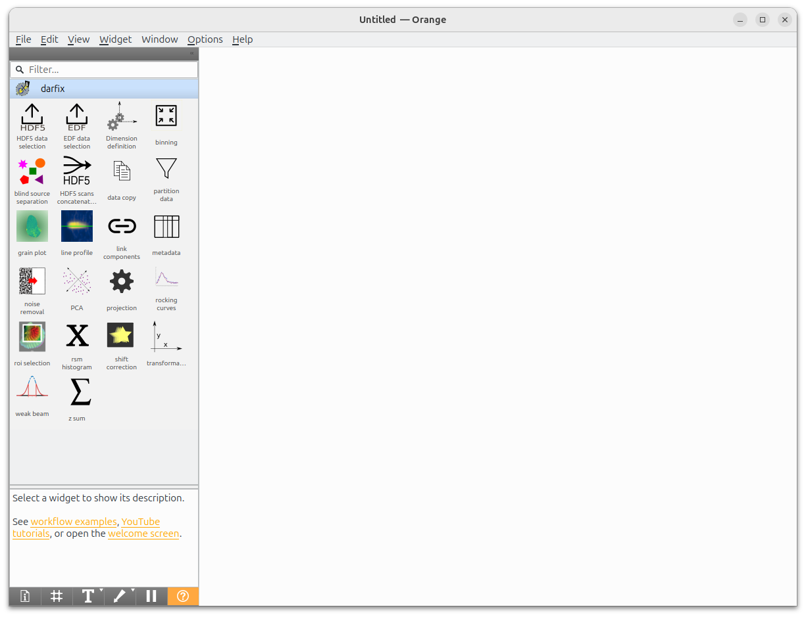

Outside ESRF
""""""""""""

Install ``darfix`` according to the instructions in :ref:`Installation`

Then, you can launch darfix by running

.. code-block:: bash

    darfix

and get the same window as above.

Workflow creation
-----------------

To get a workflow quickly, you can start from one of the **workflow examples**.

For this tutorial, we will use the workflow `Tutorial workflow for HDF5 Data`

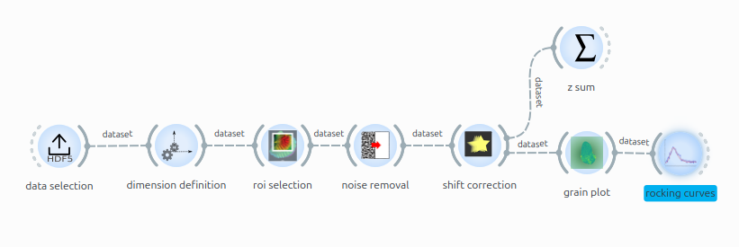

.. admonition:: Info

    If you wish, you can also build your own workflow by clicking on any widget you want from the left panel. 
    
    Drag your mouse from a widget output to another widget input to create a link.

Data selection for a HDF5 dataset
"""""""""""""""""""""""""""""""""

**HDF5 data selection** allows to select the HDF5 file containing our frames and the scan to be studied. For this, click on **Browse** button in the **File selection** row.

In the next screenshot, a local file called 'example.h5' was selected.

Then, you can select a scan via the **Scan number** combo box (9.1). By doing so, the next fields will be filled automatically by guessing the positioners and detector paths. If those do not look right, you can still edit them manually.

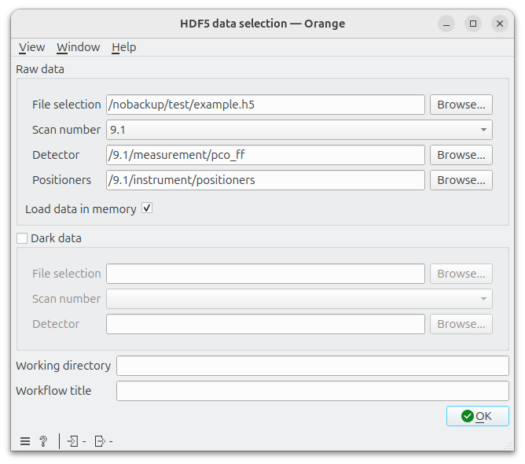

**Working directory** is the directory where processed data are saved by other darfix tasks.
You can define it with the corresponding field in this form.

.. hint::

    If the raw data is stored according to the ESRF data policy, the working directory will be set by default to the corresponding ``PROCESSED_DATA`` folder.
    
    Example:

    - If the raw data is stored at ``/data/visitor/ma1234/id00/20250509/RAW_DATA/sample/sample_dset/sample_dset.h5``
    - The default analysis folder will be ``/data/visitor/ma1234/id00/20250509/PROCESSED_DATA``
    
    Else, the working directory will be the directory of the input file

Dimension definition
""""""""""""""""""""

**Dimension definition** is needed to select which motors are moving during the scan. This information is needed later in the workflow.

.. hint::

    If the data was acquired with **fscan2d**, **darfix** will be able to retrieve all dimensions just by reading the metadata in the HDF5 input file so that no further action is needed:

    .. image:: img/introduction/dimension_definition_autofill.png

For other scans, you will have to click on **Find dimensions** to trigger a simple detection algorithm. The detected dimensions will be displayed on the table like below

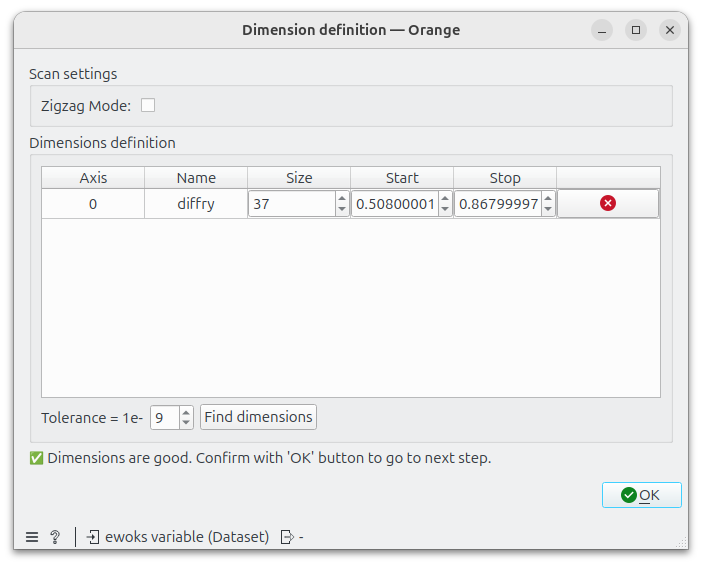

Note that this algorithm may fail to detect the right amount of steps for certain motors. The tooltip at the bottom should help you to find out what is wrong.

In this case, you can either change the parameters manually to the right value or decrease the exponent of the tolerance value (hence, increasing it) and click on **Find dimensions** again.

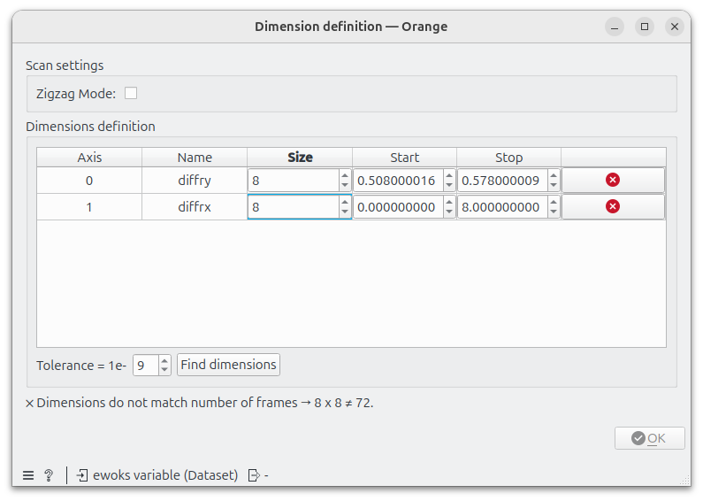

Region of interest
""""""""""""""""""

Most of the time, the sample signal appears only in part of the field of view. In this case, it is best to crop the images to
a region of interest, containing the sample signal.

This will make both the analysis faster (less data to treat), and help you to see
closer the different features of the sample.

The region of interest will be defined by the red rectangle that
appears on the view. You can move, reshape this rectangle, and click **Apply** to see the new region. 

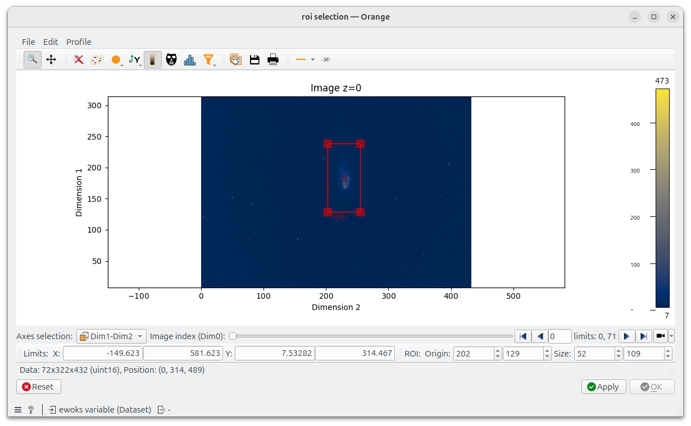

If you are satisfied with the result, click the now enabled **OK** button to go to the next step. 

Else, click **Reset** to start over.

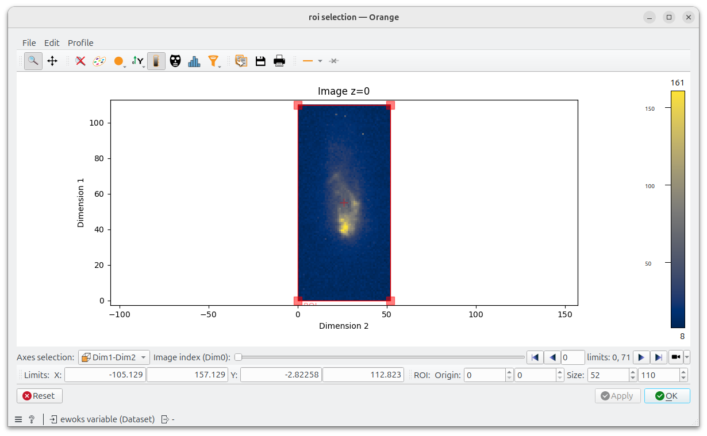

Noise removal
"""""""""""""

**Noise removal** allows you to apply several operations on the images to clean the dataset.

The different operations are subtracting background, removing hot pixels, filtering data below and above a
certain threshold and applying mask.

Each operation can be applied successively by clicking on the corresponding **Compute** button. After an operation is applied, it will be added to the history below. All operations can be cleared by clicking on **Reset**.

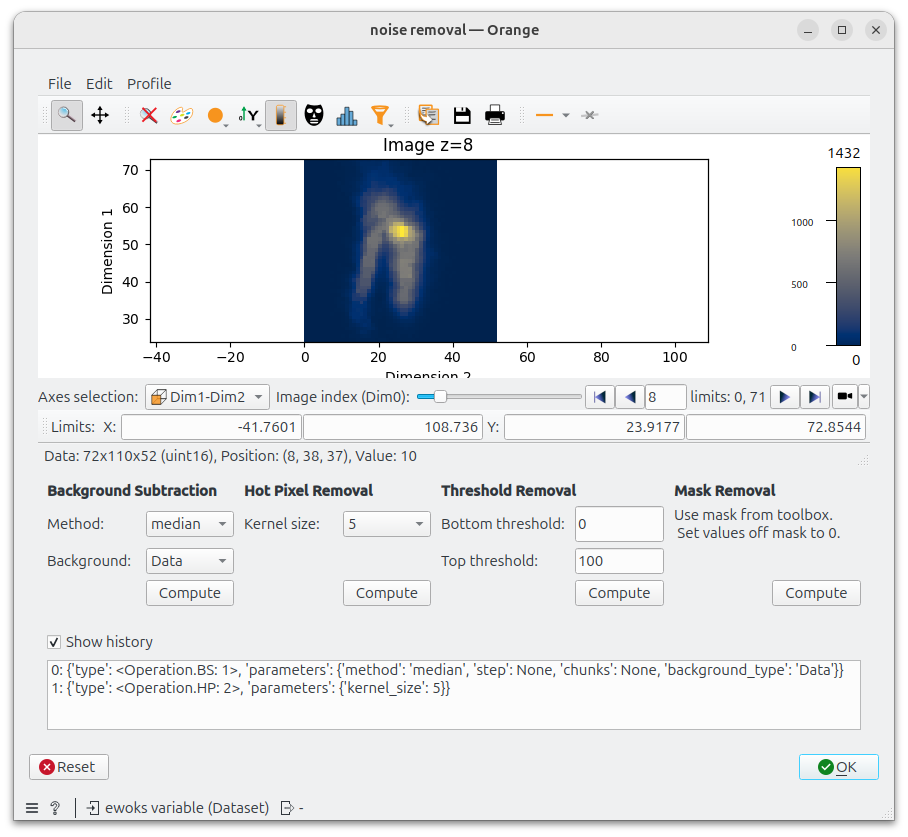

Once you have completed noise removal you can press **OK** and go to the next step

.. tip::

    Consider the data! If the data/Background Intensity
    relation is big, you can considerably increase your threshold, if the difference between data
    and background is not so big, you might be losing information by removing too much.

Shift detection and correction
""""""""""""""""""""""""""""""

The consecutive images might show a displacement of the object of study that does not correspond to reality. This
displacement is here identified as shift and can be detected.

By clicking **Find shift**, a shift value can be detected and applied to the dataset. 

This shift value can be edited by hand and visualized by clicking **Correct** for further refinement.

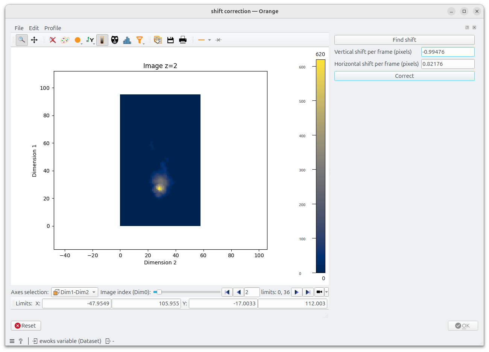

Once the shift looks good, click **OK** to move to the next step.

ZSum
""""

To check our whole scans in a single frame and check the dataset is clean and ready for next steps, this is a good practice to use ZSum.

ZSum sum all images of the dataset (or along a given dimension).

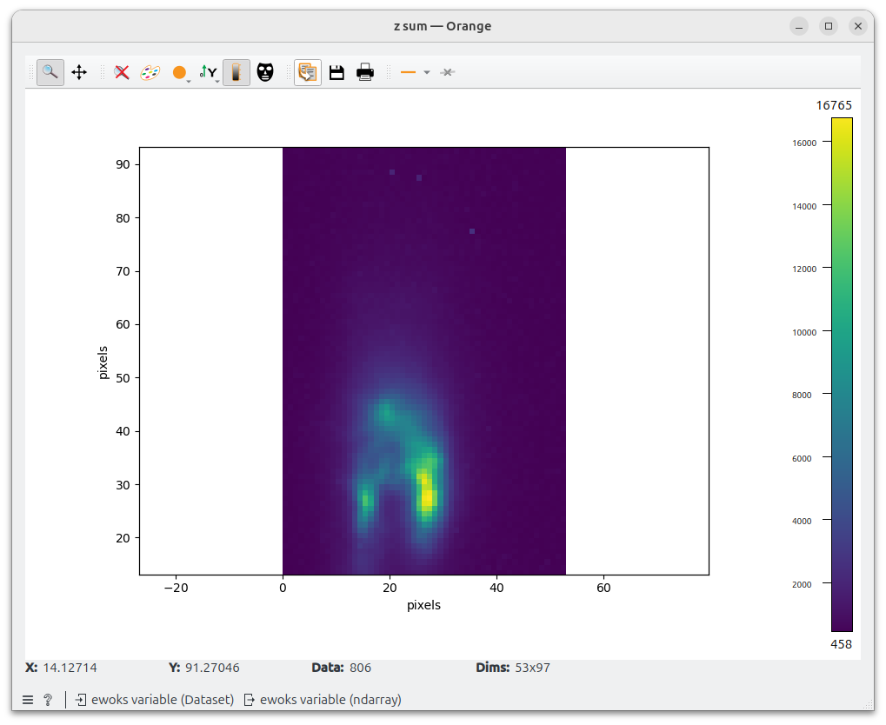

.. tip::
    In the example, we see that some noise is remaining. Maybe we need apply a threshold or a hot pixel removal.

Grain plot
""""""""""

Once **OK** was clicked on the previous step, computation of statistical measures will be launched in this widget.

Once this is done (it may take a while, you can see the progress on the terminal), several maps will be shown:

* **Center of mass (COM)**: Shows the map of COM for every motor. The center of mass looks at the intensity as a function of a motor position, using the intensity values of the images as a statistical weight
* **Full width half maximum (FWHM)**: Same as COM but with the standard deviation
* **Skewness, Kurtosis**: third and fourth-order computed `standardized moments <https://en.wikipedia.org/wiki/Standardized_moment>`_
* **Mosaicity** (only for datasets with more than two motors): `HSV <https://en.wikipedia.org/wiki/HSL_and_HSV>`_ image that has the COM of the first motor as hue and the COM of the second motor as saturation.
* **Orientation distribution** (only for datasets with more than two motors): colormap for the mosaicity and that includes the contour map of the orientation distribution.

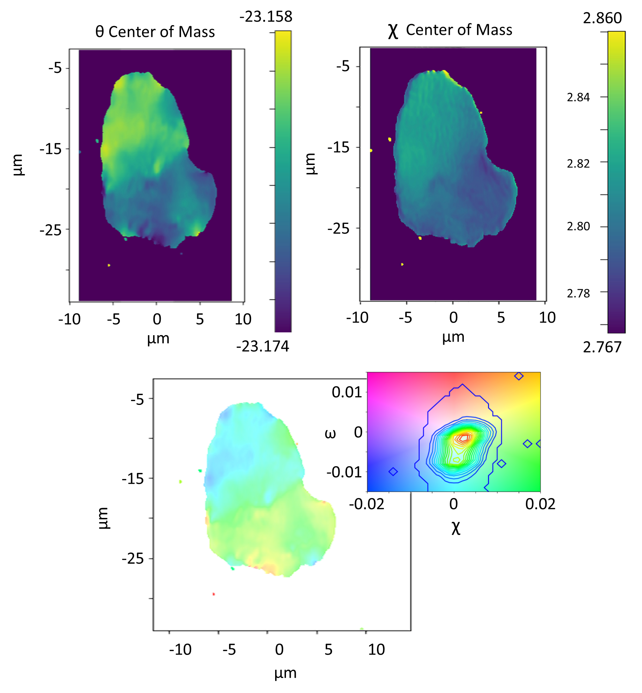

Rocking curve imaging
"""""""""""""""""""""

The rocking curves widget allows you to see a curve of the intensity of each pixel along
the dataset. When clicking at any pixel on the plot on the top left plot, two curves will show on the top right plot,
The blue curve is the rocking curve of the pixels intensity, and the red curve shows the fit along a Gaussian function.

If you are working with multi-motor datasets, you will see that the rocking curve has many
peaks, which results in a wrong fit curve. This is because there is a peak for each motor
value. In such cases, you have to click on **Filter by dimension** and choose a motor and a
value to work with.

Below the plots, there is a button **Fit data**  that will trigger a Gaussian fit for **all** pixels. 
The **Intensity threshold** can be used to fasten the computation by
omitting pixels whose curve has no intensity variation: the entered number is the
maximum intensity variation used to omit that pixel, above that the pixel will be fitted.

With two-motor datasets, the fit will be recursively done along the chosen dimension
values.

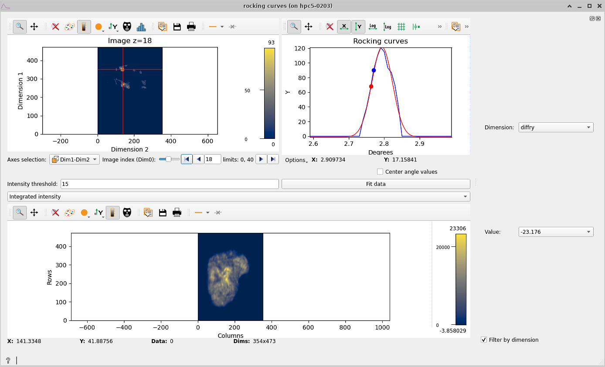

When the fitting has finished (it may take a while, you can see the progress on the
terminal), four maps appear at the bottom: integrated intensity, FWHM, peak position
and residuals map. These maps are computed using the fitted data and the residuals
map is a measure of how good the fit is.
