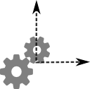

dimension definition
====================

Select the dimensions that define the dataset.

Signals
-------

**Inputs**:

- Dataset: input dataset

**Outputs**:

- Dataset: output dataset

Description
-----------

Widget to load the dimensions composing the dataset. The dimensions shape (size)
should be compatible with the dataset shape. The **Fit** button makes sure of
this compatibility and allows to continue with the workflow if the result is positive.

The **Find dimensions** option looks for unique values around the metadata of the
files and checks for dimensions that have more than one unique value. These
are then added to the list of dimensions for the user to choose and _fit_.

The _tolerance_ should be modified if the _size_ of any dimension doesn't
make sense with the dataset shape. It can be possible that when looking for
unique values, _darfix_ precision is too high(low) and values that should be
considered as equal(different) are not.
The global _tolerance_ is used when finding dimensions. The _tolerance_ for each
dimension is then used when fitting and it modifies the _size_ of that dimension.

In the _information_ icon the values of the dimensions are shown.
