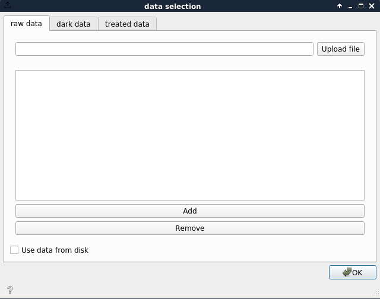

EDF data selection
==================

Data selection dedicated to EDF datasets.

Select the raw data and dark frames from disk.

.. hint::

   for hdf5 dataset see :ref:`HDF5 data selection`

Signals
-------

**Outputs**:

- Dataset: output dataset

Demo
----

.. video:: http://www.silx.org/pub/doc/darfix/video/data_input/load_edf_dataset.webm
   :width: 500

Description
-----------

Raw data
""""""""

darfix has two ways to load the data, either from the first file of the series (all images
have to have the same filename except for the last number> file01.edf, file02.edf,
file03.edf, file01.edf can be given), or by directly adding all the images of the dataset
clicking the Add button.

**Data** widget retrieves selected files from disk and sends it to the output.
The files are downloaded to the local memory and the necessary information for the analysis
is retrieved.

1. If the raw data is read only, the treated data path should be filled with the
   path of a directory with write access.
2. If the data doesn't fit in memory, the *in disk* checkbox should be ticked.

Metadata
""""""""

In certain cases it is useful to easily read the metadata information from the data. For
this we have the metadata widget, which displays all the metadata information depending on the headers of the data. This can be useful in cases where, for example,
the dimensions can’t be fitted, so you can see if there is a problem with the motors
range.

.. note::

   Sometimes, in cases where steps between motors are very low,
   the conversion from string to integers can have a precision error that
   results in two images having the same value for a motor. If this happens, modify the step value in the motors.
