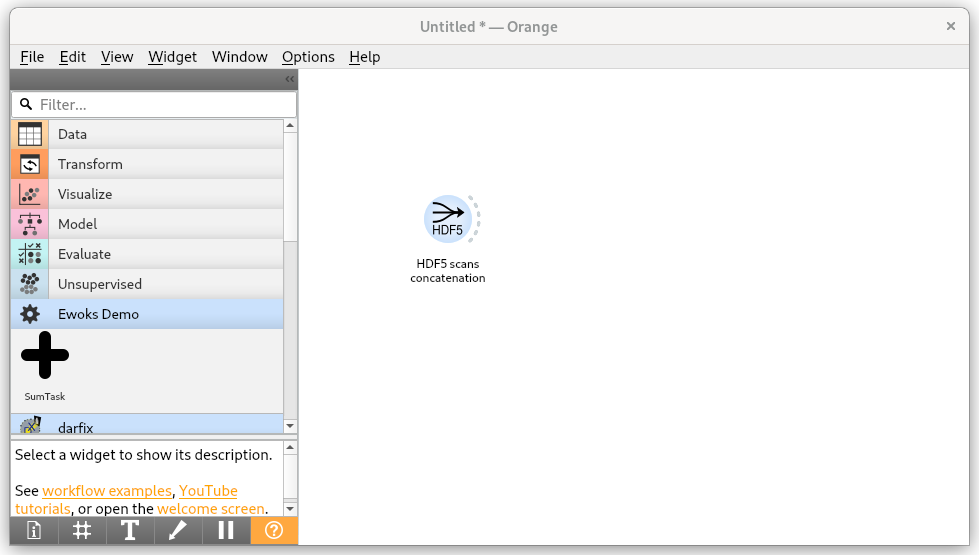
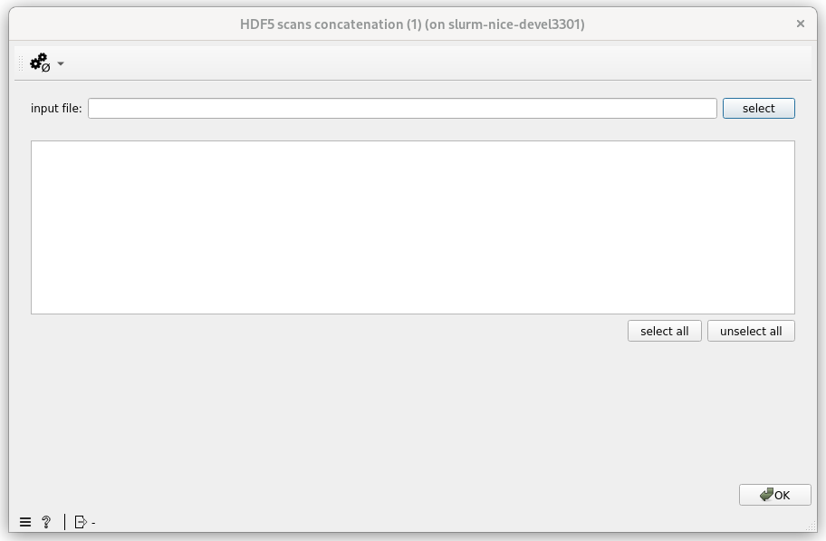
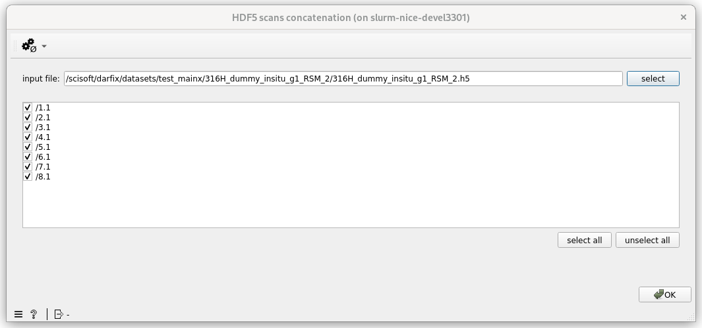
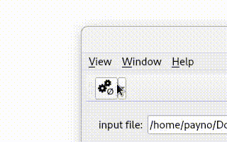
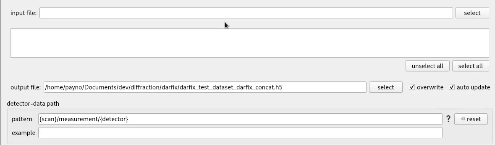

HDF5 scans concatenation
========================

This widget allows to concatenate a series of scans **from the same file** into a single HDF5 group.

Signals
-------

**Outputs**:

- output_file: output file containing the concatenated HDF5 group

Description
-----------

Will concatenate a series of scans together.
For now, only the detector dataset and the positioners - metadata group will be concatenated into output groups / datasets

Demo
----

.. video:: http://www.silx.org/pub/doc/darfix/video/data_input/concatenate_hdf5_scans.webm
   :width: 500

Tutorial
--------

1. Add the widget to the canvas and / or open the interface
'''''''''''''''''''''''''''''''''''''''''''''''''''''''''''

2. Select the file containing the scans to be concatenated together
'''''''''''''''''''''''''''''''''''''''''''''''''''''''''''''''''''

It will update the list of scans that can be concatenated.

.. warning::

   the concatenation expects all HDF5 root groups to have the same layout. It also expects scans to be named '1.x', '2.y'...

.. hint::

   If the 'auto update' checkbox (available from the advanced settings) is active, then the output file name will be automatically deduced.
   If you want to provide it manually please uncheck _Auto update_

3. Select the scans to be concatenated
''''''''''''''''''''''''''''''''''''''

If you don't want to concatenate all scans you can select / unselect some

4. validate
'''''''''''

Once you are happy with the selection, you can validate by clicking on `Ok`. This will launch the concatenation and trigger downstream widgets.

Usually after having run the concatenation, you want to run the :ref:`HDF5 data selection` widget. You can connect the two together.

Advanced options
----------------

You can access the advanced options from the settings level menu 

    Settings level

From the advanced settings you can provide

* *output file* and option to *overwrite* if exists

.. warning::

   by default the option is to overwrite the output file. If 'auto update' is selected then the output file name will be updated automatically
   when the input file is given. (input_file.h5 -> input_file_darfix_concat.h5)

* *detector data path*: location to the detector. The default value should fit bliss files.
   You can modify it if you like. See :ref:`Data path pattern` for details.
   The example line solves the 'pattern' from the HDF5 root entry.
   If it succeeds, it will also provide a 'direct' feedback to know if the data path can be found (green) or not (red) from the file (and first file entry).

   Data path selection feedback

* *metadata group path*: (positioners): location to the HDF5 group containing positioners information. Used for example to define dataset dimensions from motors.
You can modify it like the `detector data path` (see above).
